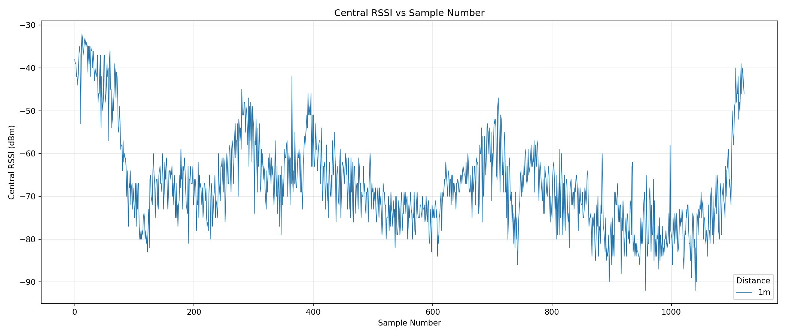

# Connection Monitor Demo README

基于 TI CC2745x10 系列芯片的 Connection Monitor. 所有 demo 均基于 SimpleLink F3 SDK 开发，目的是演示一些常用的 BLE 功能.

## 环境搭建

Demo 需要运行在 CC23xx 或 CC27xx 开发板上，导入工程前请先下载 SimpleLink F3 SDK.

#### 硬件环境
- 2x [LP-EM-CC2745R10-Q1 Launchpad](https://www.ti.com/tool/LP-EM-CC2745R10-Q1) or 2x [LP-EM-CC2340R5 Launchpad](https://www.ti.com/tool/LP-EM-CC2340R5)
- 2x [LP-XDS110 Debugger](https://www.ti.com/tool/LP-XDS110ET)

**NOTE: 此例程基于 CC2745**

#### 软件环境

- [Code Composer Studio 集成开发环境](https://www.ti.com/tool/CCSTUDIO)
- [SimpleLink Low Power F3 SDK (9.20.00.81)](https://www.ti.com/tool/download/SIMPLELINK-LOWPOWER-F3-SDK)

#### 手机App（可选）

- [SimpleLink Connect Application on iOS](https://apps.apple.com/app/simplelink-connect/id6445892658)
- [SimpleLink Connect Application on Android](https://play.google.com/store/apps/details?id=com.ti.connectivity.simplelinkconnect)
- [SimpleLink Connect Application source code](https://www.ti.com/tool/SIMPLELINK-CONNECT-SW-MOBILE-APP)

**NOTE：LightBlue 和 nRF Connect 也支持**

## 硬件演示环境搭建
- 将 XDS110 和 LP-EM-CC2745 连接，并使用 USB 连接线将两套板子连接同一台电脑

- 将 CM_UART 编译并烧录到 两套开发板
- IO21 - IO22
- IO22 - IO21
- 打开任意串口调试助手 (推荐使用 MobaXterm)
- 打开串口

## 结果输出 

运行结果应该为此路径下 **8dB-40ms-fob-1m_ce.log** 和 **8dB-40ms-fob-1m_cm.log** 所示，ce 为被连接板子从连接事件（Connection Event）拿到的 RSSI 值，cm 为监听角色板子监听到的 RSSI 值。

可以使用 **plot_cm_rssi.py** 和 **plot_ce_rssi.py** 分别打印得到的两组 RSSI 值进行画图。

输出结果如图：

